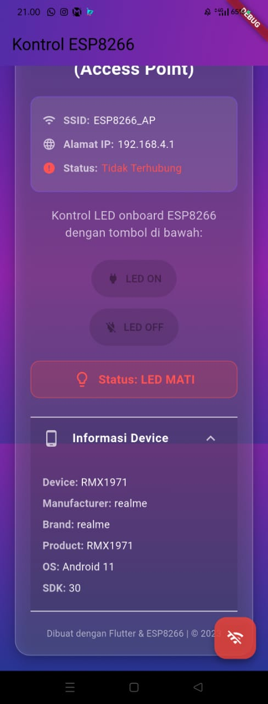
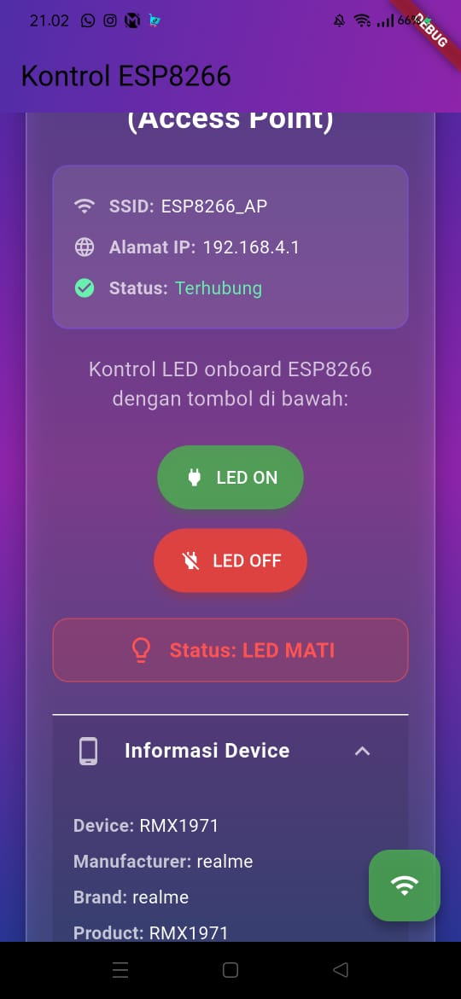
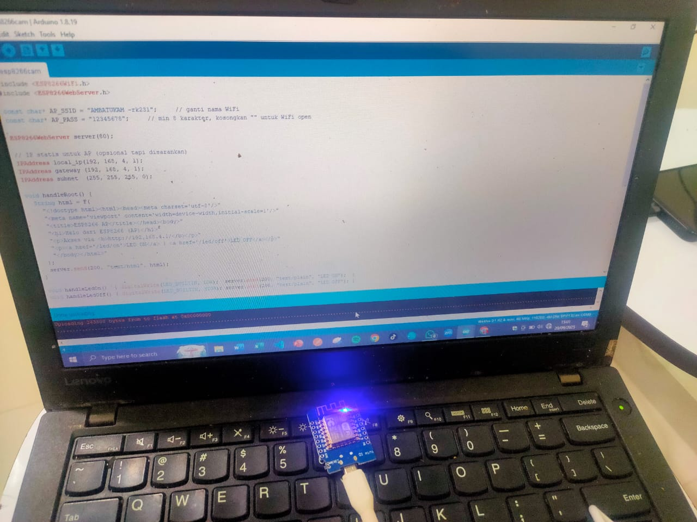

# ESP8266 Controller Flutter App

Aplikasi Flutter untuk mengontrol ESP8266 melalui koneksi WiFi Access Point.

## 📱 Gambaran Aplikasi

Aplikasi ini menyediakan antarmuka pengguna yang elegan untuk mengontrol perangkat ESP8266 yang berjalan dalam mode Access Point. Dengan aplikasi ini, Anda dapat dengan mudah menyalakan dan mematikan LED onboard ESP8266 melalui koneksi WiFi langsung.


## ✨ Fitur

- ✅ Kontrol LED ESP8266 secara real-time
- ✅ Deteksi koneksi WiFi otomatis
- ✅ UI responsif dengan gradient background yang menarik
- ✅ Informasi detail perangkat (device info)
- ✅ Tampilan status koneksi dan LED
- ✅ Dukungan multi-platform (Android, iOS, Web, Desktop)
- ✅ Notifikasi snackbar untuk feedback aksi

## 🛠️ Persyaratan

### Perangkat Keras
- NodeMCU ESP8266 atau modul ESP8266 lainnya
- Perangkat mobile/desktop untuk menjalankan aplikasi

### Perangkat Lunak
- Flutter SDK (versi terbaru direkomendasikan)
- Dart SDK
- ESP8266 yang telah diprogram dengan firmware Access Point

## 📦 Instalasi

1. **Pastikan Flutter terinstall**:
   ```bash
   flutter doctor
   ```

2. **Clone atau download proyek ini**

3. **Tambahkan dependencies di pubspec.yaml** (jika belum ada):
   ```yaml
   dependencies:
     flutter:
       sdk: flutter
     http: ^0.13.3
     connectivity_plus: ^2.3.0
     device_info_plus: ^3.2.0
   ```

4. **Jalankan perintah berikut**:
   ```bash
   flutter pub get
   ```

5. **Jalankan aplikasi**:
   ```bash
   flutter run
   ```

## 🔧 Konfigurasi ESP8266

Pastikan ESP8266 Anda telah diprogram dengan kode yang sesuai:

1. ESP8266 harus dalam mode Access Point
2. SSID: `ESP8266_AP`
3. IP Address: `192.168.4.1`
4. Endpoint API:
   - `GET /led/on` - untuk menyalakan LED
   - `GET /led/off` - untuk mematikan LED


## 📷 Tampilan Aplikasi


### Tampilan LED Mati Dan Devices Info

Tampilan ketika LED dalam keadaan mati dengan indikator status merah.


### Tampilan LED Mati

Tampilan ketika LED dalam keadaan hidup dengan indikator status hijau.

### Tampilan Foto Devices ketika build


## 🎨 Tema dan Desain

Aplikasi menggunakan skema warna modern dengan gradient:
- **Primary Gradient**: Deep Purple ke Purple
- **Background Gradient**: Deep Purple → Purple → Indigo
- **Button Colors**: 
  - ON: Green
  - OFF: Red
- **Status Indicators**: 
  - Terhubung: Green
  - Tidak Terhubung: Red

## 📱 Penggunaan

1. **Hubungkan perangkat Anda ke WiFi ESP8266**:
   - SSID: `ESP8266_AP`
   - Password: `passwordAP` (jika ada)

2. **Buka aplikasi ESP8266 Controller**

3. **Periksa status koneksi** - pastikan status menunjukkan "Terhubung"

4. **Gunakan tombol ON/OFF** untuk mengontrol LED ESP8266

5. **Periksa status LED** pada panel status di aplikasi

## 🔍 Informasi Perangkat

Aplikasi menampilkan informasi detail perangkat yang mencakup:
- Model perangkat
- Sistem operasi
- Versi
- Informasi spesifik platform


## 🌐 Dukungan Platform

Aplikasi ini mendukung berbagai platform:
- ✅ Android
- ✅ iOS
- ✅ Web
- ✅ Linux
- ✅ macOS
- ✅ Windows

## ⚠️ Troubleshooting

### Masalah Koneksi
- Pastikan perangkat terhubung ke WiFi ESP8266_AP
- Periksa apakah ESP8266 sudah menyala dan berjalan dengan benar
- Verifikasi alamat IP ESP8266 (default: 192.168.4.1)

### Masalah Kompilasi
- Jalankan `flutter clean` dan `flutter pub get`
- Pastikan semua dependencies terinstall dengan benar

### Aplikasi Tidak Merespon
- Periksa koneksi WiFi
- Pastikan ESP8266 sedang berjalan dalam mode AP

## 📄 API Reference

### Endpoints
- `http://192.168.4.1/led/on` - Menyalakan LED
- `http://192.168.4.1/led/off` - Mematikan LED

### Response
- `200 OK` dengan pesan teks "LED ON" atau "LED OFF"

## 🔧 Customization

### Mengubah Alamat IP
Ubah variabel `_apIP` di dalam class `ESPControlPageState` jika ESP8266 Anda menggunakan IP yang berbeda.

### Menyesuaikan Tema
Modifikasi properti theme dalam `MaterialApp` dan warna gradient di `Container decoration` untuk menyesuaikan dengan preferensi Anda.

## 📝 Lisensi

Proyek ini menggunakan lisensi MIT. Silakan lihat file LICENSE untuk detail lebih lanjut.

## 🤝 Berkontribusi

Kontribusi selalu diterima! Silakan ajukan pull request atau buat issue untuk fitur baru atau perbaikan bug.

## 📞 Support

Jika Anda mengalami masalah atau memiliki pertanyaan, silakan buat issue di repository GitHub proyek ini.

---

**Dibuat dengan ❤️ menggunakan Flutter By Stevanus Andika Galih Setiawan**